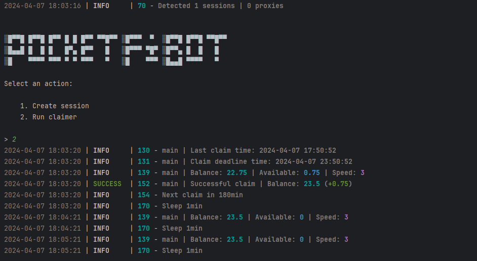

[](https://t.me/sho6ot)




> 🇷🇺 README на русском доступен [здесь](README.md)

## Functionality
| Functional                                                     | Supported |
|----------------------------------------------------------------|:---------:|
| Multithreading                                                 |     ✅     |
| Binding a proxy to a session                                   |     ✅     |
| Auto-purchase of items if you have coins (tap, energy, charge) |     ✅     |
| Random sleep time between clicks                               |     ✅     |
| Random number of clicks per request                            |     ✅     |
| Support tdata / pyrogram .session / telethon .session          |     ✅     |

## [Settings](https://github.com/shamhi/PocketFiBot/blob/main/.env-example)
| Настройка               | Описание                                                                   |
|-------------------------|----------------------------------------------------------------------------|
| **API_ID / API_HASH**   | Platform data from which to launch a Telegram session (stock - Android)    |
| **CLAIM_RETRY**         | Number of tryings if **Claim** is unsuccessful _(eg 3)_                    |
| **SLEEP_BETWEEN_CLAIM** | Delay between **Claim** in minutes _(eg 180)_                              |
| **USE_PROXY_FROM_FILE** | Whether to use proxy from the `bot/config/proxies.txt` file (True / False) |

## Installation
You can download [**Repository**](https://github.com/shamhi/PocketFiBot) by cloning it to your system and installing the necessary dependencies:
```shell
~ >>> git clone https://github.com/shamhi/PocketFiBot.git
~ >>> cd PocketFiBot

# If you are using Telethon sessions, then clone the "converter" branch
~ >>> git clone https://github.com/shamhi/PocketFiBot.git -b converter
~ >>> cd PocketFiBot

#Linux
~/PocketFiBot >>> python3 -m venv venv
~/PocketFiBot >>> source venv/bin/activate
~/PocketFiBot >>> pip3 install -r requirements.txt
~/PocketFiBot >>> cp .env-example .env
~/PocketFiBot >>> nano .env # Here you must specify your API_ID and API_HASH , the rest is taken by default
~/PocketFiBot >>> python3 main.py

#Windows
~/PocketFiBot >>> python -m venv venv
~/PocketFiBot >>> venv\Scripts\activate
~/PocketFiBot >>> pip install -r requirements.txt
~/PocketFiBot >>> copy .env-example .env
~/PocketFiBot >>> # Specify your API_ID and API_HASH, the rest is taken by default
~/PocketFiBot >>> python main.py
```

Also for quick launch you can use arguments, for example:
```shell
~/PocketFiBot >>> python3 main.py --action (1/2)
# Or
~/PocketFiBot >>> python3 main.py -a (1/2)

#1 - Create session
#2 - Run clicker
#3 - Run via Telegram
```
